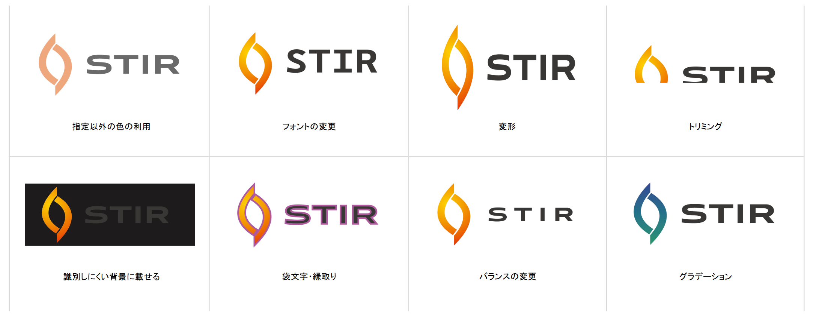

<h1>Stir Logo</h1>
<h2>ガイドライン</h2>

    

<h2>メインカラー</h2>

デジタルデータの場合は指定色を選択し、印刷時は色見本チップと比較して最大限に近づけてください。

  <table>
    <tr>
      <td></td>
      <td>
        <table>
          <tr>
            <td>RGB</td>
            <td>247 183 51</td>
          </tr>
          <tr>
            <td>CMYK</td>
            <td>0% 26% 79% 3%</td>
          </tr>
          <tr>
            <td>HEX</td>
            <td>#F7B733</td>
          </tr>
          <tr>
            <td>DIC</td>
            <td>DIC-2071</td>
          </tr>
        </table>
        <table>
          <tr>
            <td>RGB</td>
            <td>252 74 26</td>
          </tr>
          <tr>
            <td>CMYK</td>
            <td>0% 71% 90% 1%</td>
          </tr>
          <tr>
            <td>HEX</td>
            <td>#FC4A1A</td>
          </tr>
          <tr>
            <td>DIC</td>
            <td>DIC-2516</td>
          </tr>
        </table>
      </td>
      <td></td>
       <td>
        <table>
          <tr>
            <td>RGB</td>
            <td>25 25 25</td>
          </tr>
          <tr>
            <td>CMYK</td>
            <td>0% 0% 0% 90%</td>
          </tr>
          <tr>
            <td>HEX</td>
            <td>#191919</td>
          </tr>
          <tr>
            <td>DIC</td>
            <td>DIC-555</td>
          </tr>
        </table>
      </td>
    </tr>
  </table>

*本来のグラデーションは垂直ではありません。

 

<h2>バリエーション</h2>

ロゴを表示する場合、以下のバリエーションのデジタルデータにより形を正確に再現してください。

    <table>
      <tr>
        <td> 
基本形
</td>
        <td> 
モノクロの場合
</td>
        <td> 
背景に濃い色が使われる場合
</td>
    </table>

 

<h2>利用禁止例</h2>

  

 
